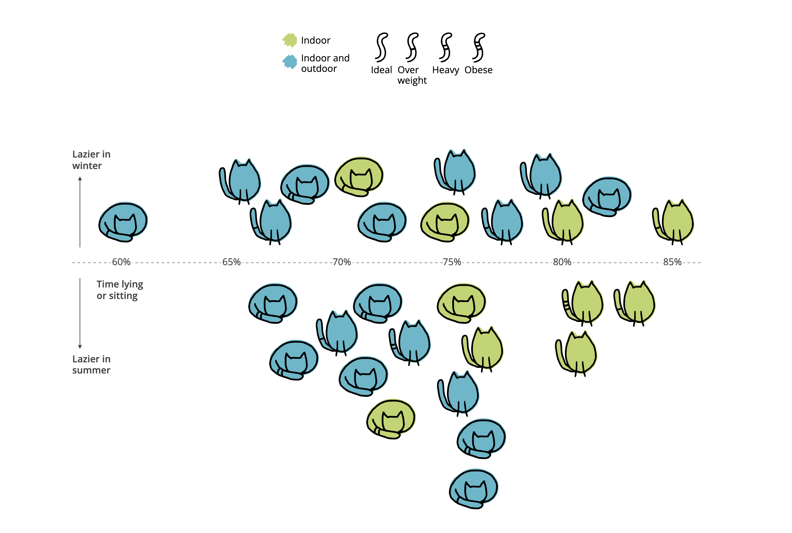
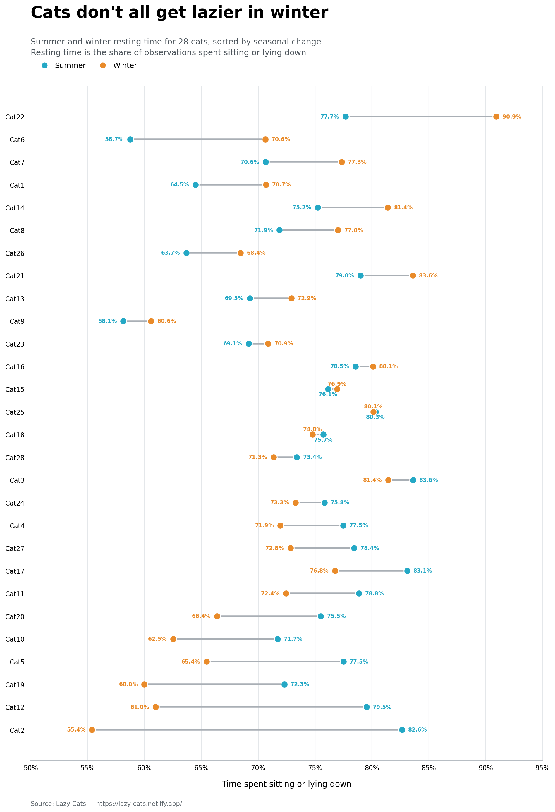
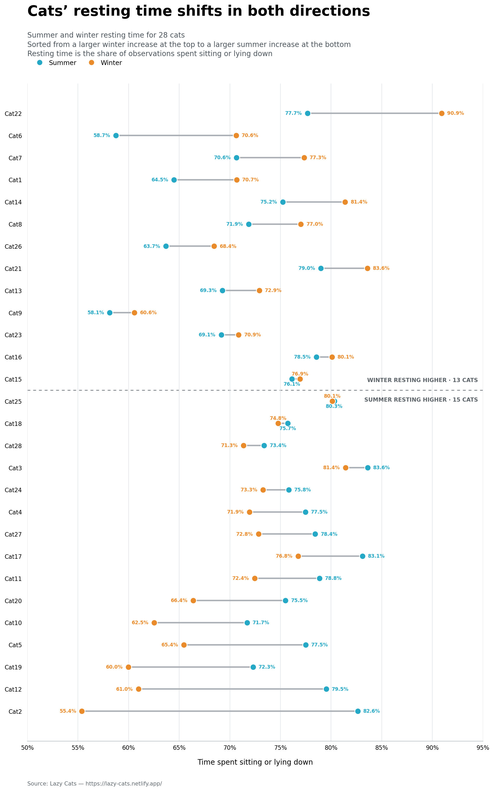

| [home page](https://gyhhh28.github.io/seeing-data/) | [data viz examples](dataviz-examples) | [critique by design](critique-by-design) | [final project I](final-project-part-one) | [final project II](final-project-part-two) | [final project III](final-project-part-three) |

# Critique and Redesign: Lazy Cats

For this assignment, I picked a Makeover Monday chart about pet cats and how much time they spend resting in different seasons. I liked the original at first because it is cute and easy to look at. But once I tried to compare the cats more carefully, I realized that the design was doing more decoration than explaining.

## Step one: the visualization

Original visualization: 

I chose this visualization mostly because the topic is cute. Cats make people want to look at the chart before they even know what the data is about, which I think is valuable. At the same time, the original design made me curious about what the data was actually saying. I could see lots of cats and different shapes, but I could not quickly tell which cats changed the most between summer and winter.

The dataset includes the same 28 cats in both seasons, so it gave me a clear way to make those comparisons more visible without losing the playful feeling of the original.

## Step two: the critique
I completed the Data Visualization Effectiveness Profile in the Google Form. I gave the original chart credit for being visually interesting. The cats are fun to look at, and the colors make it easy to notice that some cats are indoor-only while others also go outside. It's mainly aimed at cat owners or general readers rather than people doing formal research. The illustrations make it easy to approach, but the lack of clear labels and exact seasonal values makes it less useful for someone who wants to inspect the data closely.

But the more I looked at it, the less sure I was what I was supposed to compare. I could not identify individual cats, and the chart does not show the summer and winter numbers separately. The vertical placement tells me whether a cat was lazier in winter or summer, but not how big that change was. It also uses color, cat shape, horizontal position, and vertical position all at the same time.

My redesign focuses on making the comparison more direct. I decided to show each cat twice—once for summer and once for winter—and connect the two values with a line. That way, a reader can see both the direction of the change and how large it is.

## Step three: Sketch a solution
Before making the final chart, I sketched out a connected dot plot. Each row would be one cat. Blue would stand for summer, orange would stand for winter, and the line between them would show how much the cat changed.

This felt like a better fit for the data because the reader can compare the two seasons without having to decode cat shapes or guess what the vertical position means. I also sorted the cats by their winter-versus-summer difference. Cats near the top had a bigger increase in resting time during winter; cats near the bottom had a bigger increase during summer.

## Step four: Test the solution

Before sharing the draft, I asked each person three broad questions:
- What do you think this chart is showing?
- What is the main takeaway you notice?
- Is anything confusing or difficult to read?

Results:

| Question | Interview 1 | Interview 2 |
| --- | --- | --- |
| What do you think this chart is showing? | It compares how much time each cat spent sitting or lying down in summer versus winter. | It shows the difference in resting time between summer and winter for 28 individual cats. |
| What is the main takeaway you notice? | Many cats rested more in winter in winter, but a substantial number actually rested less. Cat 2 appears to have the largest seasonal change. | There is no consistent pattern across all cats. Some become much lazier in winter, while others are more active in winter. |
| Is anything confusing or difficult to read? | The middle section is slightly crowded because some values are very close together. | The colors and labels are clear, but it took a moment to realize that the cats are sorted by the size and direction of the seasonal change. |

Synthesis: 
Both classmates understood the basic comparison without extra explanation, so the connected-dot format was working. They also came away with the same larger point: the cats do not all follow one seasonal pattern.

The useful criticisms were about readability rather than the main idea. One person found the middle a little crowded, and the other did not immediately notice how the cats were sorted. For the final version, I added more spacing, made the sort order explicit in the subtitle, and separated cats that rested more in winter from cats that rested more in summer.

## Step five: build the solution

For the final version, I kept the connected-dot idea but made a few changes based on the feedback. The subtitle now explains that the cats are sorted by seasonal difference. I also separated the chart into two groups: cats that rested more in winter and cats that rested more in summer. That makes the overall pattern easier to notice right away.

The chart shows that there is not one answer for every cat. Thirteen cats spent more time sitting or lying down in winter, while fifteen did so in summer. Cat 22 had the largest increase in winter resting time, while Cat 2 had the largest increase in summer resting time.

I think this version is still simple enough for a general audience, but it is much easier to compare individual cats than the original illustration-based chart. The exact values are visible, the colors only represent season, and the line shows the size of each cat’s change.

## References
- [Lazy Cats](https://lazy-cats.netlify.app/)
- [Makeover Monday: 2025 Week 47 — Lazy Cats](https://makeovermonday.vercel.app/dataset/2025-week-47-lazy-cats)
- [Figshare dataset: How lazy are pet cats really?](https://bit.ly/4p0Omn3)
- [Stephen Few, Data Visualization Effectiveness Profile](http://www.perceptualedge.com/articles/visual_business_intelligence/data_visualization_effectiveness_profile.pdf)

## AI acknowledgements
I used ChatGPT to help me work through the CSV fields, calculate resting time from propLying + propSitting, and think through possible chart designs. It also helped me create a first digital draft and revise the final layout after I received feedback. I checked the values in the final chart against the supplied dataset.
