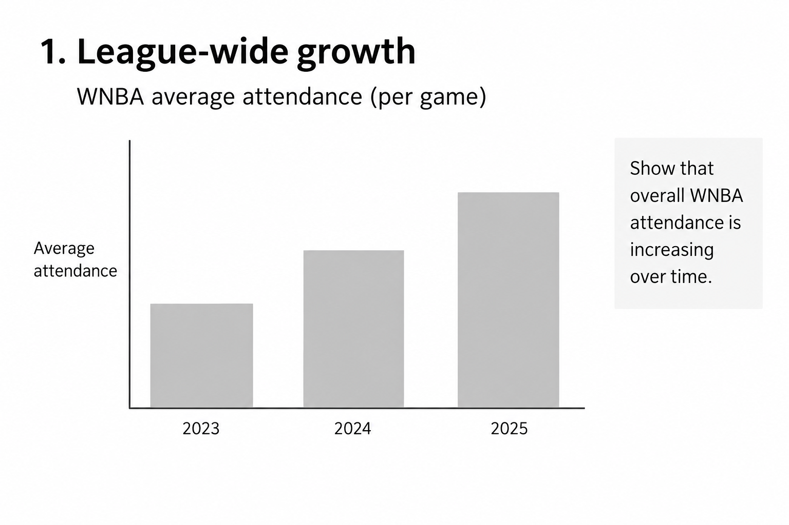
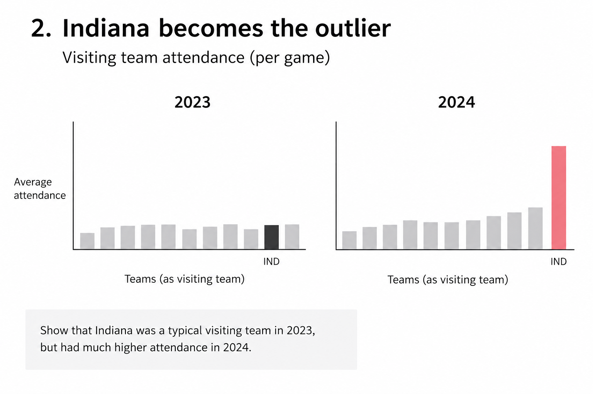
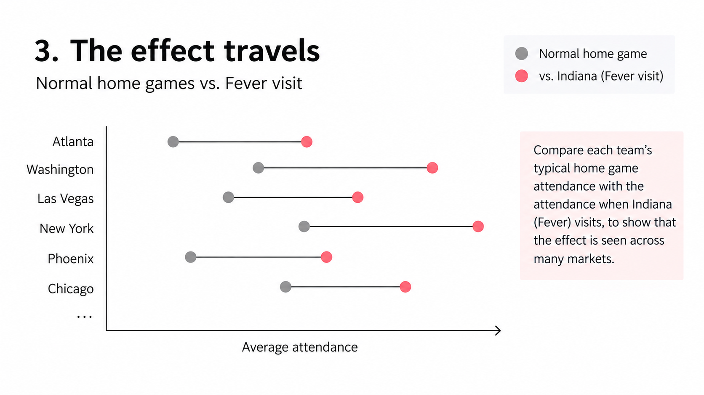
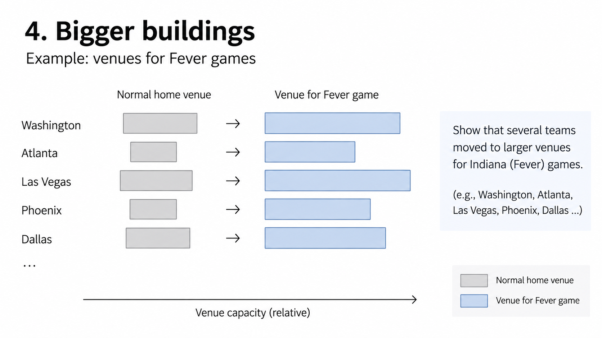

| [home page](https://gyhhh28.github.io/seeing-data/) | [data viz examples](dataviz-examples) | [critique by design](critique-by-design) | [final project I](final-project-part-one) | [final project II](final-project-part-two) | [final project III](final-project-part-three) |

# Outline

The WNBA has experienced substantial growth in attendance in recent seasons, but that growth has not been evenly distributed across games. This project will examine one particularly visible part of that change: the unusually high attendance associated with Indiana Fever games following Caitlin Clark's arrival in the WNBA in 2024. Rather than focusing on Clark as an individual athlete, I want to use this case to explore a broader question about audience demand in professional sports: can the arrival of one high-profile player create an attendance effect that extends beyond her own team's home market?

The project will compare game-level attendance across the 2023, 2024, and 2025 WNBA seasons, separating broader league growth from the additional attendance associated with Indiana Fever road games. Venue changes will provide another measure of demand by showing whether teams moved Fever games to different or larger arenas. Comparing the pattern across all three seasons will also help determine whether the attendance effect persisted into 2025. Rather than attributing the WNBA's overall growth to a single player, the analysis will focus on how the Fever's attendance pattern differed from broader changes across the league.

# Project Structure
### 1. Establish the boom

The story will begin with the broader rise in WNBA attendance from 2023 to 2025. This establishes an important baseline: attendance was already growing across the league, so higher attendance at Fever games cannot automatically be attributed to Caitlin Clark.

### 2. Find the outlier

Next, Indiana Fever road games will be compared with other games hosted by the same teams. The 2023 season will provide a baseline for determining whether Indiana was already an attendance outlier before Clark entered the league, while the 2024 season will show how that pattern changed after her arrival.

### 3. Follow the effect across markets

The analysis will then examine how the pattern appeared across different WNBA markets rather than focusing only on Indiana's home attendance. This comparison will show whether the attendance premium traveled with the team and whether it was concentrated in a few cities or appeared more broadly across the league.

### 4. Look at how teams responded

Attendance alone does not tell the entire story. Venue changes for Fever games will provide another measure of demand, particularly in cases where teams hosted Indiana in different or larger arenas.

### 5. Test whether it lasted

Finally, the 2025 season will be used to examine whether the pattern was primarily a first-year spike or whether an attendance premium remained after Clark's rookie season. The project will end by returning to the broader question: how much can one superstar reshape demand across an entire sports league?

# Initial sketches
These sketches are conceptual and show the planned structure of the visualizations rather than final data values.

### 1. League-wide growth

This visualization will establish the broader growth in WNBA attendance from 2023 to 2025.

### 2. Indiana becomes the outlier

This visualization will compare Indiana with other visiting teams before and after Clark entered the league.

### 3. The effect travels

This visualization will compare each team's typical home attendance with attendance when the Fever visits. The 2024 and 2025 results will also be compared to show whether this pattern persisted beyond Clark's rookie season.

### 4. Bigger buildings

This visualization will show examples of teams moving Fever games to larger venues in response to higher expected demand.

# The data
The primary data source for this project is the ESPN WNBA schedule dataset published through SportsDataverse. It provides game-level records, with each row representing a single WNBA game. The analysis will focus on the 2023, 2024, and 2025 regular seasons, using variables such as game date, home and away teams, attendance, and venue. This level of detail makes it possible to examine differences across individual games and markets rather than relying only on league-wide season averages.

The analysis begins by establishing the league-wide attendance trend across the three seasons. From there, attendance at Indiana Fever road games will be compared with other games hosted by the same teams, with 2023 serving as a pre-Clark baseline and 2024 and 2025 showing how the pattern changed over time. Venue information provides another dimension of the story by identifying games that were moved away from a team's usual home venue. When necessary, official WNBA reports and team or arena sources will provide additional context, particularly for information such as venue capacity.

| Name | Data | Description |
|---|---|---|
| ESPN WNBA Schedule Data | [Dataset](https://github.com/sportsdataverse/sportsdataverse-data/releases/tag/espn_wnba_schedules) | SportsDataverse release containing game-level WNBA schedule data. |
| 2023 WNBA Schedule | [CSV](https://github.com/sportsdataverse/sportsdataverse-data/releases/download/espn_wnba_schedules/wnba_schedule_2023.csv) | Game-level data used as the pre-Clark baseline. |
| 2024 WNBA Schedule | [CSV](https://github.com/sportsdataverse/sportsdataverse-data/releases/download/espn_wnba_schedules/wnba_schedule_2024.csv) | Game-level data for Clark's rookie season. |
| 2025 WNBA Schedule | [CSV](https://github.com/sportsdataverse/sportsdataverse-data/releases/download/espn_wnba_schedules/wnba_schedule_2025.csv) | Game-level data used to examine whether the attendance pattern continued after 2024. |

# Method and medium
The final project will be presented as a scroll-based visual story using Shorthand, with the main data visualizations created in Tableau. The narrative will move from the league-wide attendance trend to game-level comparisons, differences across markets, venue changes, and the persistence of the pattern into 2025. Interactive elements will be used selectively when they help readers explore differences across teams or seasons, while the overall experience will remain guided by the story rather than structured as a standalone dashboard.

## References
* SportsDataverse. *ESPN WNBA Schedules*. SportsDataverse Data Repository. Accessed September 2026. [Dataset](https://github.com/sportsdataverse/sportsdataverse-data/releases/tag/espn_wnba_schedules)

* WNBA. *WNBA Delivers Record-Setting 2024 Season*. September 27, 2024. [Official Release](https://www.wnba.com/news/wnba-delivers-record-setting-2024-season)

## AI acknowledgements
I used ChatGPT as a brainstorming and editing tool during the development of this project proposal. It helped me refine the scope of my research question, think through possible ways to structure the story, and improve the clarity of some written sections. I also used AI to create rough visual mockups based on my planned visualization ideas.
