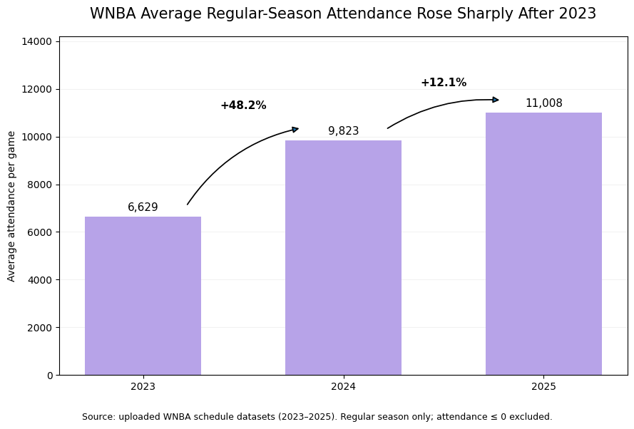
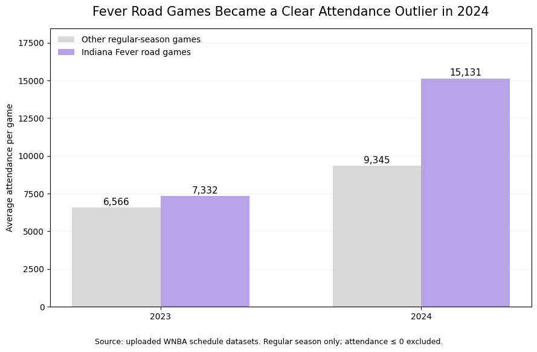
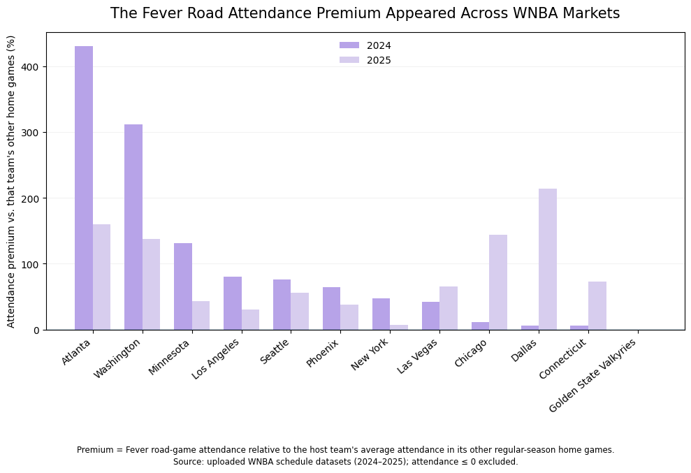
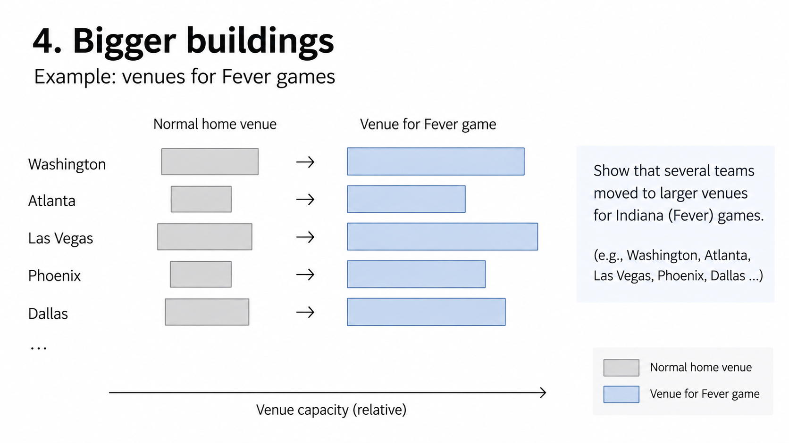

| [home page](https://gyhhh28.github.io/seeing-data/) | [data viz examples](dataviz-examples) | [critique by design](critique-by-design) | [final project I](final-project-part-one) | [final project II](final-project-part-two) | [final project III](final-project-part-three) |

# Wireframes / storyboards

Building on the sketches from Part I, I developed three draft visualizations that represent the main stages of my story. The story begins with the broader growth in WNBA attendance, then focuses on the Indiana Fever as an attendance outlier, and finally examines whether the Fever road effect appeared across different markets and persisted into 2025.

## 1. Establishing the league-wide attendance boom

The first visualization establishes the broader context by showing the
increase in average regular-season attendance from 2023 to 2025. Average
attendance increased sharply from 2023 to 2024 and continued to grow in
2025, although at a slower rate.

## 2. Finding the outlier

The second visualization shifts the focus to Indiana Fever road games.
In 2023, attendance at Fever road games was only moderately higher than
attendance at other regular-season games. In 2024, however, the gap
became much larger, suggesting that Fever road games had become an
unusual attendance draw within the broader league-wide increase.

## 3. Following the effect across markets

The third visualization examines the Fever road effect at the market
level. Instead of relying only on a league-wide average, it compares
attendance at Fever road games with each host team's typical home-game
attendance. The comparison across 2024 and 2025 also begins to explore
whether the effect persisted beyond its initial breakout season.

## 4. How teams responded

The next stage of the story examines how WNBA teams responded to the
increased demand surrounding Fever road games. In particular, I plan to
look at cases where games were moved to larger venues and compare the
additional seating capacity with actual attendance.

This section remains at the storyboard stage for Part II and will be
developed further for Part III.

# User research 

## Target audience
My target audience is general sports audiences with varying levels of familiarity with basketball and the WNBA. I want the story to be understandable to readers who may have heard of the WNBA or Caitlin Clark but do not necessarily follow the league closely. The story should provide enough context for a reader without extensive basketball knowledge while still offering meaningful insights for people who already follow sports.

To identify representative individuals for user research, I will use familiarity with basketball and the WNBA as the main selection criterion. Rather than selecting three participants with similar sports backgrounds, I will intentionally recruit people at different levels of basketball familiarity. This allows me to test whether the story works across the range of readers I hope to reach. I will look for participants who fit the following three profiles:

1. **A person with little or no basketball knowledge.** This participant will help me evaluate whether the story provides enough context for someone unfamiliar with basketball and the WNBA.

2. **An NBA viewer who does not regularly follow the WNBA.** This participant understands basketball but has limited knowledge of the WNBA, allowing me to test whether the story communicates the Fever road effect clearly without requiring prior knowledge of the women's league.

3. **A fan of another sport, such as volleyball, with limited basketball knowledge.** This participant represents a general sports audience who is familiar with sports concepts but may not know much about professional basketball.

By deliberately selecting participants with different levels of basketball familiarity, I can compare where their interpretations are similar or different. In particular, I want to identify which parts of the story are confusing only to less familiar readers and which problems appear across all three audience types.

## Interview script
The interviews will focus on whether participants can understand the main story without additional explanation from me. I will show each participant the same storyboard and draft visualizations and ask them to interpret what they see before providing any additional context.

| Goal | Questions to Ask |
|------|------------------|
| Evaluate whether the overall story is clear | After looking through the story, what do you think the main takeaway is? How would you describe the story in your own words? |
| Test whether individual visualizations are understandable | What do you think each chart is showing? Was there anything in the charts that you found difficult to understand or interpret? |
| Evaluate whether the transition from league-wide growth to the Fever road effect is clear | After seeing the first two charts, how would you describe the relationship between overall WNBA attendance growth and attendance at Fever road games? |
| Test whether the market-level comparison is intuitive | Looking at the market-level chart, what does "attendance premium" mean to you? Is it clear what the Fever road games are being compared against? |
| Identify missing context | Was there any point where you felt you needed more information to understand what was happening or why it mattered? What additional context would have helped? |
| Identify misleading or overly strong interpretations | Did any part of the story make you think it was claiming that the Fever or Caitlin Clark directly caused the attendance increase? If so, which part gave you that impression? |
| Evaluate visual hierarchy and attention | Which chart or piece of information stood out to you the most? Was there anything important that you almost missed? |
| Identify opportunities for revision | If you could change one thing about the story or visualizations to make them easier to understand, what would you change? |

I will avoid explaining the intended meaning of a visualization before participants respond. If a participant is confused, I will first ask them to describe what they think the visualization means and what caused the confusion. This will help distinguish problems in the visualization itself from differences in participants' prior knowledge.

## Interview findings

I interviewed three participants with different levels of familiarity with basketball. Interview 1 had little knowledge of basketball or the WNBA. Interview 2 regularly watches the NBA but does not follow the WNBA. Interview 3 follows other sports but has only limited familiarity with basketball. All three participants were shown the same storyboard and draft visualizations.

The interviews suggested that the overall narrative was understandable, but the market-level visualization created more confusion than the first two charts. Differences in basketball familiarity also affected how much background information participants felt they needed.

| Questions | Participant 1: Little/no basketball knowledge | Participant 2: NBA fan | Participant 3: Other-sport fan |
|---|---|---|---|
| What do you think the main takeaway of the story is? | Understood that WNBA attendance increased sharply, especially in 2024, but was confused about why the story suddenly focused so heavily on the Indiana Fever. Asked, "Who even is this team? Why are they everywhere?" | Saw the main story as two related patterns: rapid league-wide growth and unusually high attendance at Indiana Fever road games. | Understood that WNBA attendance was generally increasing while the Indiana Fever appeared to be a major statistical outlier in road-game attendance. |
| Were the visualizations easy to understand? | Found the first chart very straightforward and the second mostly clear, but found the third chart difficult to interpret and was unsure what the percentages represented. | Found the first two charts clear and direct. Thought the third chart contained too much information and required more attention to the axis labels. | Found the first two charts easy to follow, but thought extreme values in the third chart visually dominated the other markets and made comparisons difficult. |
| What does "attendance premium" mean to you? | Initially thought "premium" referred to higher ticket prices. Even after realizing it referred to attendance, the comparison baseline was unclear. | Correctly understood it as higher attendance at Fever road games relative to a team's normal home games, but thought "premium" sounded too financial and suggested more explicit wording. | Interpreted it as additional attendance but was unsure whether the baseline was arena capacity or a team's normal attendance. |
| Does the story imply that the Fever or Caitlin Clark caused the overall attendance growth? | Yes. The transition from league-wide growth directly into the Fever analysis made the participant assume that a superstar on the team was responsible for the overall increase. | Thought the narrative structure strongly encouraged a causal interpretation even though the charts did not explicitly make that claim. Suggested more clearly separating league-wide growth from the Fever-specific effect. | Felt that the story strongly implied that the arrival of the Fever's star player produced the league-wide attendance boom, which seemed stronger than what the analysis demonstrated. |
| What additional context would help? | Wanted a short introduction explaining who Caitlin Clark is and why the Indiana Fever are important to the story. | Wanted venue information, especially for games that were moved from smaller venues into larger arenas. | Wanted more explanation for the extreme differences between markets and a clearer definition of the comparison baseline. |
| If you could change one thing, what would it be? | Add introductory context about Caitlin Clark and the Fever, and replace "attendance premium" with simpler language. | Add venue information and make the comparison in the market-level visualization more explicit. | Redesign the market-level chart so that a few extreme values do not dominate the visualization and make the baseline clearer. |

### Key findings

Several themes appeared across the three interviews despite the participants' different levels of basketball familiarity.

First, all three participants found the first two visualizations easier to understand than the market-level visualization. The third chart created two related problems: the meaning of "attendance premium" was not immediately clear, and several extremely large percentage values visually dominated the chart. This suggests that the market-level comparison needs both clearer language and a different visual treatment.

Second, the story currently assumes too much knowledge about the Indiana Fever. This was most apparent for the participant with little basketball knowledge, who understood the league-wide attendance increase but did not understand why the story suddenly focused on the Fever. A brief introduction to Caitlin Clark and the Fever would make this transition more accessible to the intended general sports audience.

Third, all three participants noticed a potential problem with causality. The current narrative moves directly from league-wide attendance growth to the Fever road effect, which can imply that the Fever or Caitlin Clark caused the overall increase. The data presented here demonstrates a strong association between Fever road games and higher attendance, but does not by itself establish that the Fever caused the league-wide attendance boom.

Finally, participants wanted more context for the large differences between markets. In particular, the NBA fan pointed to games being moved into larger arenas as an important factor that could affect observed attendance. This supports developing the venue-response section further in Part III rather than interpreting the market-level percentages in isolation.

# Identified changes for Part III

Based on the interviews, I identified several areas where the story and visualizations could be made clearer for readers with different levels of basketball knowledge.

| **Research synthesis** | **Anticipated changes for Part III** |
|---|---|
| The first two visualizations were generally easy to understand, but the market-level visualization required more effort to interpret. | Simplify the market-level visualization and reduce unnecessary visual complexity so that the comparison across markets is easier to scan. |
| "Attendance premium" was not immediately clear to all participants, and some were unsure what the percentages were being compared against. | Replace or more clearly define "attendance premium" and explicitly state that Fever road-game attendance is being compared with the same team's other home games. |
| Some participants initially interpreted the transition from league-wide growth to the Fever road effect as a causal claim about the Fever or Caitlin Clark. | Revise the narrative language to more clearly distinguish the overall WNBA attendance boom from the additional attendance associated with Fever road games, avoiding unsupported causal claims. |
| Participants wanted more explanation for why some markets showed extremely large differences in attendance. | Develop the venue-response section further by examining cases where Fever road games were played in larger venues. This will provide additional context for some of the largest market-level differences. |
| Participants with less WNBA knowledge wanted more context about why the Indiana Fever were central to the story. | Add a brief introduction before the Fever-specific analysis to establish the team's relevance without assuming prior WNBA knowledge. |

These findings reinforced the importance of designing the story for readers who do not already follow the WNBA. For Part III, my main priority will be improving the clarity of the market-level comparison and adding enough context for readers to understand why the Fever are important without requiring prior knowledge of the league. I also plan to be more careful about distinguishing patterns in the data from causal claims. The venue-response section will be developed further to help explain how arena size and scheduling decisions may have shaped some of the attendance patterns shown in the data.

## References
The data sources used for the three draft visualizations are the same as those documented in [Part I](https://gyhhh28.github.io/seeing-data/final-project-part-one). See Part I for the full list of data sources and links.

## AI acknowledgements
I used AI to help analyze the WNBA game-level attendance data in Python and create draft visualizations based on my story outline. I also used ChatGPT to brainstorm and refine my user research questions, organize interview findings, and improve the clarity and wording of my written explanations. 
